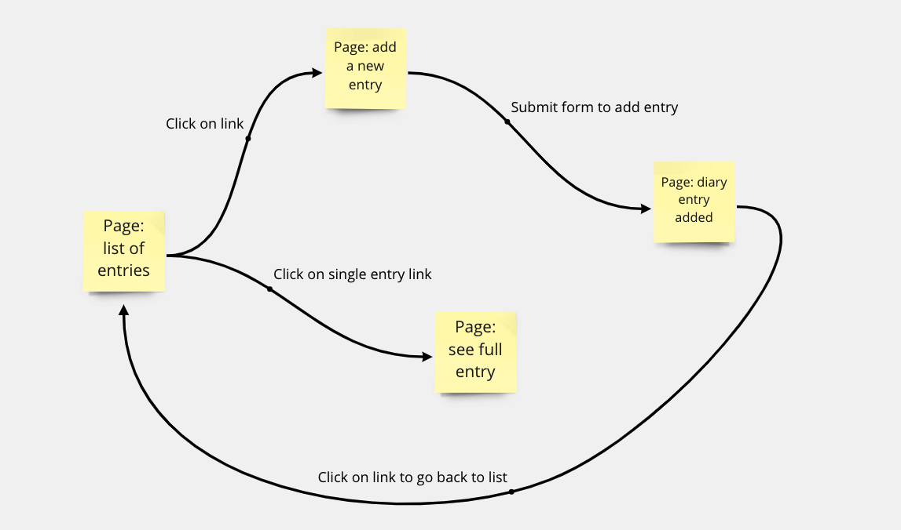

# Modelling and Planning a Web application

## Step 0: User stories or specification

```
As a user
So that I can keep a daily diary
I want to be able to add a new Diary Entry

As a user
So that I can identify my entry in future
I want to give each Diary Entry a Title and a Content

As a user
So that I can browse my previous entries
I want to see a list of Diary Entry Titles

As a user
So that I can read my previous entries
I want to click on a title to see the full Diary Entry
```

## Step 1: Planning pages

You'll have to adopt the perspective of a user browsing your website. What are the
different pages that they will use? How does the user navigate to these pages (links,
forms)?

At this point, it's good to do a small diagram of the different pages and their
relationship. If you want to do more complex mockups with the details of the elements on
the page, you can also do it, but it's not necessary to go into this level of detail for
this step.

Here's an example of how the user stories above can be planned. Note that this is only one
of the many possible flows that could be planned for these user stories.



## Step 2: Planning routes

Remember that a web application flow is all based on the HTTP request-response cycle, from
the web browser to the server application. You'll now need to draw your routes from the
pages you planned at the previous step.

This time, we're switching from the user perspective to the HTTP application engineer's
perspective - thinking of the application's behaviour in requests and responses, rather
than pages.

For example:

 * A page (such as the home page) is usually returned by a `GET` route. For example, the
   home page (which is almost always the first route you'll start with), is usually `GET
   /`.
 * If the user navigates to a different page using a link, you will need a `GET` route for
   this other page.
 * If the user submits a form that leads to a different page, you will need a `POST` route
   to submit this form to.

From the pages planned above, here are the routes we could plan. Once again, this is only
a possible list of routes for this case — you could come up with slightly different ones,
which would still satisfy the initial user stories.

```md
# Page: list of entries (aka the homepage)

## Request:
GET /
No parameters

## Response (200 OK)
HTML view with list of entries
```

```md
# Page: see full entry 

## Request:
GET /entries/:id
With path parameter :id

## Response (200 OK)
HTML view with details of a single entry
```

```md
# Page: add a new entry

## Request:
GET /entries/add
No parameters

## Response (200 OK)
HTML view with form to submit new entry (to POST /entries)
```

```md
# Page: new entry added

## Request:
POST /entries
With parameters:
  title="What a great Sunday"
  content="..."

## Response (200 OK)
HTML view with confirmation message
```

## Step 3: Test-drive and implement

You'll now test-drive and implement each route. If your application interacts with a
database to store its data, you'll also have to test-drive and implement other layers of
the program (such as Repository classes) as part of your work.

## Challenge

Model and plan the pages and routes for the following web application, which is a game of
Rock Paper Scissors. Test-drive and implement it if you'd like an extra challenge.

```
As a Maker
So I can play Rock Paper Scissors
I would like to enter my move on the home page
And click to confirm my move (rock, paper or scissors)

As a Maker
So I can play Rock Paper Scissors
I would like the opponent's move to be decided randomly by the program

As a Maker
So I can play Rock Paper Scissors
I would like to see the result of the game on the next page

As a Maker
So I can play Rock Paper Scissors again
I would like to click on a link on the result page
So it takes me back to the home page
```


<!-- BEGIN GENERATED SECTION DO NOT EDIT -->

---

**How was this resource?**  
[😫](https://airtable.com/shrUJ3t7KLMqVRFKR?prefill_Repository=makersacademy%2Fweb-applications&prefill_File=pills%2Fmodelling_and_planning_web_application.md&prefill_Sentiment=😫) [😕](https://airtable.com/shrUJ3t7KLMqVRFKR?prefill_Repository=makersacademy%2Fweb-applications&prefill_File=pills%2Fmodelling_and_planning_web_application.md&prefill_Sentiment=😕) [😐](https://airtable.com/shrUJ3t7KLMqVRFKR?prefill_Repository=makersacademy%2Fweb-applications&prefill_File=pills%2Fmodelling_and_planning_web_application.md&prefill_Sentiment=😐) [🙂](https://airtable.com/shrUJ3t7KLMqVRFKR?prefill_Repository=makersacademy%2Fweb-applications&prefill_File=pills%2Fmodelling_and_planning_web_application.md&prefill_Sentiment=🙂) [😀](https://airtable.com/shrUJ3t7KLMqVRFKR?prefill_Repository=makersacademy%2Fweb-applications&prefill_File=pills%2Fmodelling_and_planning_web_application.md&prefill_Sentiment=😀)  
Click an emoji to tell us.

<!-- END GENERATED SECTION DO NOT EDIT -->
